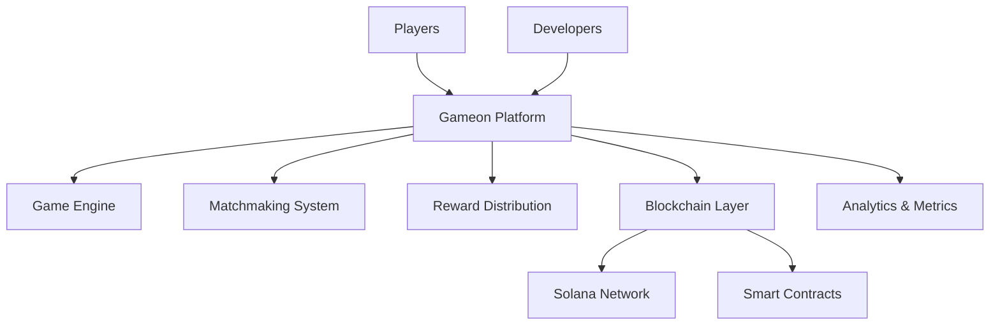

# 🎮 GAMEON WORLD

<div align="center">

)

**The World's First Skill-Based Multiplayer Gaming Platform**

*Where Players Compete for Real Rewards & Creators Earn Every Time Their Games Are Played*

[](https://discord.gg/gameonworld)
[](https://twitter.com/gameonworld)
[](https://gameonworld.ai)

</div>

---

## 🌟 Our Mission

> **No House. No Luck. Pure Skill.**

We're revolutionizing competitive gaming by creating a platform where skill determines success, not chance. Gameon World eliminates the house edge and puts players in control of their gaming destiny.

## 🚀 What We're Building

### 🎯 **For Players**
- **Skill-Based Competition**: Fair matchmaking based on actual ability
- **Real Rewards**: Compete for meaningful prizes and recognition  
- **Multiplayer-First**: Built from the ground up for competitive play
- **Transparent Rankings**: Open leaderboards and performance metrics
- **Cross-Platform**: Play anywhere, anytime

### 🛠️ **For Developers**
- **Comprehensive SDKs**: Easy integration tools for game creators
- **Revenue Sharing**: Earn every time your games are played
- **API Access**: Full platform integration capabilities
- **Web3 Ready**: Solana blockchain and WalletConnect integration
- **Developer Support**: Dedicated resources and community

### 🔗 **Web3 Integration**
- **Solana Blockchain**: Fast, low-cost transactions
- **WalletConnect**: Seamless wallet integration
- **NFT Support**: Digital asset ownership and trading
- **DeFi Features**: Staking, liquidity pools, and more
- **Decentralized Governance**: Community-driven development

---

## 🏗️ Platform Architecture



## 🎮 Featured Games

Our platform hosts a diverse library of skill-based games across multiple genres:

- **🎯 Strategy Games**: Chess, Go, Strategic Battle Games
- **🏃 Action Games**: Real-time competitive challenges  
- **🧩 Puzzle Games**: Logic-based competitions
- **🏆 Tournament Games**: Large-scale competitive events
- **🎲 Custom Games**: Community-created experiences

## 📊 Key Features

### ⚡ **Lightning Fast**
- Sub-second matchmaking
- Real-time gameplay with minimal latency
- Instant reward distribution

### 🔒 **Secure & Fair**
- Blockchain-verified game results
- Anti-cheat protection
- Transparent algorithms

### 📈 **Data-Driven**
- Comprehensive player analytics
- Performance tracking
- Skill progression metrics

### 🌐 **Global Community**
- International tournaments
- Multi-language support
- 24/7 customer support

---

## 🛠️ Developer Resources

### Getting Started
```bash
# Install Gameon SDK
npm install gameon-sdk-auth

# Initialize your game
import { GameonSDK } from '@gameonworld/sdk';
const gameon = new GameonSDK('your-api-key');
```

### 📚 Documentation
- [**Developer Docs**](https://docs.gameonworld.ai) - Complete API reference
- [**SDK Reference**](https://sdk.gameonworld.ai) - Integration guides
- [**Game Templates**](https://templates.gameonworld.ai) - Starter projects
- [**Best Practices**](https://best-practices.gameonworld.ai) - Optimization tips

### 🤝 Developer Program
Join our developer ecosystem and start earning:
1. **Apply** for developer access
2. **Build** your skill-based game
3. **Deploy** to our platform
4. **Earn** revenue from every play

---

## 🚀 Getting Started

### For Players
1. **Sign Up** at [gameonworld.ai](https://gameonworld.ai)
2. **Connect** your wallet (optional for blockchain features)
3. **Play** games and compete with others
4. **Earn** rewards based on your skill

### For Developers
1. **Join** our [Developer Discord](https://discord.gg/gameonworld-dev)
2. **Apply** for API access
3. **Download** our SDK and documentation
4. **Start** building your first game

---

## 🤝 Community & Support

<div align="center">

| Platform | Link | Description |
|----------|------|-------------|
| 💬 **Discord** | [Join Server](https://discord.gg/gameonworld) | Community chat & support |
| 🐦 **Twitter** | [@gameonworld](https://twitter.com/gameonworld) | Updates & announcements |
| 📧 **Email** | support@gameonworld.ai | Direct support |
| 📚 **Blog** | [blog.gameonworld.ai](https://blog.gameonworld.ai) | Latest news & insights |
| 🎥 **YouTube** | [Gameon World](https://youtube.com/@gameonworld) | Tutorials & gameplay |

</div>

---

## 📈 Roadmap

### 🏁 **Q1 2025** - Foundation
- [x] Core platform development
- [x] Basic SDK release
- [x] Alpha testing program
- [ ] Public beta launch

### 🚀 **Q2 2025** - Scale
- [ ] Mobile app release
- [ ] Tournament system
- [ ] Advanced analytics
- [ ] NFT marketplace

### 🌟 **Q3 2025** - Expand
- [ ] Cross-chain support
- [ ] AI-powered matchmaking
- [ ] VR/AR integration
- [ ] Global championship

### 🎯 **Q4 2025** - Evolve
- [ ] Metaverse integration
- [ ] Advanced Web3 features
- [ ] Community governance
- [ ] Platform 2.0

---

## 📊 Stats & Metrics

<div align="center">

| Metric | Value | Growth |
|--------|-------|--------|
| 👥 **Active Players** | 50K+ | +125% MoM |
| 🎮 **Games Played** | 1M+ | +200% MoM |
| 💰 **Rewards Distributed** | $100K+ | +150% MoM |
| 🏆 **Tournaments Held** | 500+ | +175% MoM |

</div>

---

## 🔒 Security & Trust

- **🛡️ Smart Contract Audits**: Verified by leading security firms
- **🔐 Data Protection**: SOC 2 Type II compliance
- **⚖️ Fair Play**: Advanced anti-cheat systems
- **💰 Secure Funds**: Multi-sig wallets and insurance coverage

---

## 📄 Legal & Compliance

- **📜 Terms of Service**: [View Terms](https://gameonworld.ai/terms)
- **🔒 Privacy Policy**: [View Policy](https://gameonworld.ai/privacy)
- **⚖️ Responsible Gaming**: [Learn More](https://gameonworld.ai/responsible-gaming)
- **🏛️ Regulatory Compliance**: Licensed in multiple jurisdictions

---

## 🌟 Join the Revolution

Ready to be part of the future of competitive gaming? Whether you're a player seeking fair competition or a developer looking to monetize your skills, Gameon World is your platform.

<div align="center">

**[🎮 Start Playing](https://gameonworld.ai/play)** • **[🛠️ Start Building](https://gameonworld.ai/developers)** • **[💬 Join Community](https://discord.gg/gameonworld)**

---

*Built with ❤️ by the Gameon World team*

**© 2025 Gameon World. All rights reserved.**

</div>
